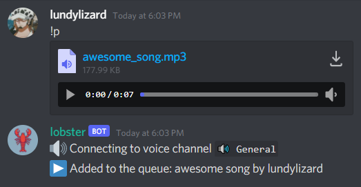
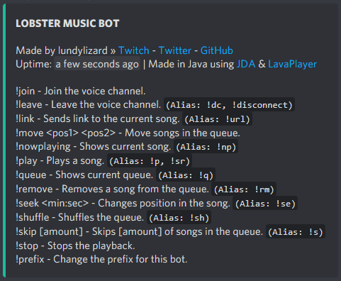

# lobster

a discord bot to play music, officially supports youtube, spotify and mp3/mp4-files. everything is handled by
lavaplayer, so for more information check that out.\
shoutout to the lobster gang, where the bot name originated from and this bot originally was planned on being used on. i had big plans for this, but i wanted to focus on something else instead, so i decided to make this public.

## credits

* bot image: https://twitter.com/pixelforgegames/status/1350128998924226561
* jda: https://github.com/DV8FromTheWorld/JDA
* lavaplayer: https://github.com/sedmelluq/lavaplayer
* spotify api wrapper: https://github.com/spotify-web-api-java/spotify-web-api-java

## invite

**this bot works without any special permissions and roles. just invite it and start jamming. you can find all commands
using the help command.**\
invitation
link: [discord.com/api/oauth2/authorize?client_id=891760327522394183&permissions=274881136640&scope=bot](https://discord.com/api/oauth2/authorize?client_id=891760327522394183&permissions=274881136640&scope=bot)

## features

this bot has the features every other music bot has too, but less bloated. no voting, no premium or other pay walls.\
another feature i added is the support to directly play embedded files

## contact

lundylizard - [@lundylizard](https://twitter.com/lundylizard) - lundylizard(at)gmail.com\
project link: [github.com/lundylizard/lobster](https://github.com/lundylizard/lobster)
