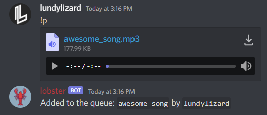

# lobster Commands:

Here you can find a list of available commands of this bot. 
You can find other functions of this bot **[here](FUNCTIONS.md)**

### Music Commands:

- [Play](#play-command)
- [Move](#move-command)
- [Remove](#remove-command)
- [Skip](#skip-command)
- [Seek](#seek-command)
- [Shuffle](#shuffle-command)
- [Leave](#leave-command)
- [Queue](#queue-command)
- [Join](#join-command)
- [Stop](#stop-command)
- [NowPlaying](#nowplaying-command)

### Miscellaneous Commands:

- [Prefix](#prefix-command)
- [Invite](#invite-command)

## Play Command

**The play command is used to add a song to the music queue.**
 
If lobster is not in a voice channel already, it will [join](#join-command) it automatically.
 
 
**Aliases:** ``p``, ``sr``
 
**Usage:** ``play <top> [search term | url]``
 
 
**Arguments:** 
``top`` - **Optional:** Adds the requested song to the top of the queue. 
``search term`` - Search term used for YouTube search. 
``url`` - If an url is provided, it will try to play the song associated with that website.
 
 
**Example:** ``play top devil town cavetown``
 
This will search for the video "devil town cavetown" on YouTube and put it to the top of the queue.
 
 
**Example:** ``play https://open.spotify.com/track/0vf2eBw2inhl8y61cYQMv2``
 
This will play a song from Spotify.
 
**Please note:** Due to [Spotify's limitations](FUNCTIONS.md#spotify-api) this will search the song on YouTube instead.
 
 
**Supported & Tested Websites:**

- YouTube
- Spotify
- SoundCloud

**You can also request embedded files or links to audio files.**
 
 

 
 
**This uses the song's metadata:**
 

## Move Command

**The move command is used to move songs in the queue.**
 
**Aliases:** ``mv``
 
**Usage:** ``move [from] [to]`` 

**Arguments:** 
``from`` - Song which will be moved. 
``to`` - Position the song will move to.
 
 
**Example:** ``move 6 9``
 
This will move the song at position 6 to position 9.

## Remove Command

**The remove command is used to remove songs from the queue.**
 
 
**Aliases:** ``rm``
 
**Usage:** ``remove [index | range]`` 

**Arguments:** 
``index`` - Position of the song to remove. 
``range`` - A range of positions to be removed.
 
 
**Example:** ``remove 6``
 
This will remove the song at position 6 from the queue.
 
 
**Example:** ``remove 3-7``
 
This will remove all songs from position 3 to 7.

## Skip Command

**The skip command is used to skip songs (in the queue).**
 
 
**Aliases:** ``s``
 
**Usage:** ``skip <amount>`` 

**Arguments:** 
``amount`` - **Optional:** Amount of songs to be skipped.
 
 
**Example:** ``skip 2``
 
This will skip 2 songs.

## Seek Command

**The seek command is used to jump to a time in the song.**
 
 
**Aliases:** None
 
**Usage:** ``seek <time>`` 

**Arguments:** 
``time`` - Time to jump to.
 
 
**Example:** ``seek 2:34``
 
This will jump to position 02:34 of the current song.

## Shuffle Command

**The shuffle command is used randomize the song queue.**
 
**Aliases:** None
 
**Usage:** ``shuffle <seed>`` 

**Arguments:** 
``seed`` - **Optional:** Set Seed for randomization.

## Leave Command

**The leave command is used to make the bot leave the voice channel.**
 
This will also stop the playback and clear the queue.
 
 
**Aliases:** ``disconnect``, ``dc``
 
**Usage:** ``leave`` 

**Arguments:** 
None.

## Queue Command

**The queue command will send you a list of the upcoming songs.**
 
It will only show the first 10 songs.
 
 
**Aliases:** ``q``
 
**Usage:** ``queue`` 

**Arguments:** 
None.

## Join Command

**The join command makes the bot join the voice channel.**
 
 
**Aliases:** None
 
**Usage:** ``join`` 

**Arguments:** 
None.

## Stop Command

**The stop command will make the bot leave the voice channel and clear the queue.**
 
 
**Aliases:** None.
 
**Usage:** ``stop`` 

**Arguments:** 
None.

## NowPlaying Command

**The nowplaying command will show you what song is currently playing**
 
 
**Aliases:** ``np``
 
**Usage:** ``nowplaying`` 

**Arguments:** 
None.

## Prefix Command

**The prefix command allows server admins to change the symbol used before commands.** 
If no argument is provided, it will show you the current prefix.
 
 
**Aliases:** None.
 
**Usage:** ``prefix <prefix>`` 

**Arguments:** 
``prefix`` - New prefix used for commands (Max Length: 10)
 
 
**Example:** ``prefix --`` 
This will change the command prefix to ``--``. Future commands will now require to be used with this prefix: ``--queue``
, ``--leave``

## Invite Command

**The invite command will send a link to invite the bot to your server.**
 
 
**Aliases:** None.
 
**Usage:** ``invite``

**Arguments:** 
None.
